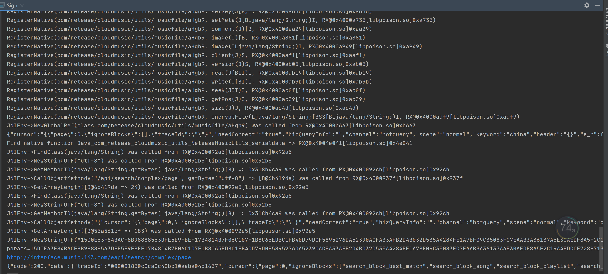

# wyy8880_unidbg_sign
使用 unidbg 模拟某云音乐 (版本: 8.8.80) 搜索协议

## how to run
1. git clone https://github.com/zhkl0228/unidbg (版本是 [3512f1d33c417c2f835430916b58612b0f7d599c](https://github.com/zhkl0228/unidbg/commit/3512f1d33c417c2f835430916b58612b0f7d599c))
2. 从[豌豆荚](https://www.wandoujia.com/apps/293217/history_v8008080)下载 wangyi8880.apk
3. 把 "wangyi8880.apk" 放到相对路径 "unidbg-android/src/test/resources/wangyi" 下
4. 把 "Sign.java" 放到相对路径 "unidbg-android/src/test/java/com/netease/cloudmusic" 下
5. 执行 Sign.java 的 main 函数

## example
